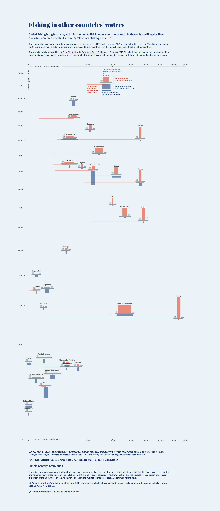

# Data for a cause: Global fishing visualisation

https://jonolave.github.io/global-fishing/

**UPDATE April 19, 2019** 
The numbers for Svalbard and Jan Mayen have been excluded from Norway's fishing activities, to be in line with the Global Fishing Watch's original data set. As a result, the blue box indicating fishing activities in Norwegian waters has been reduced.            

